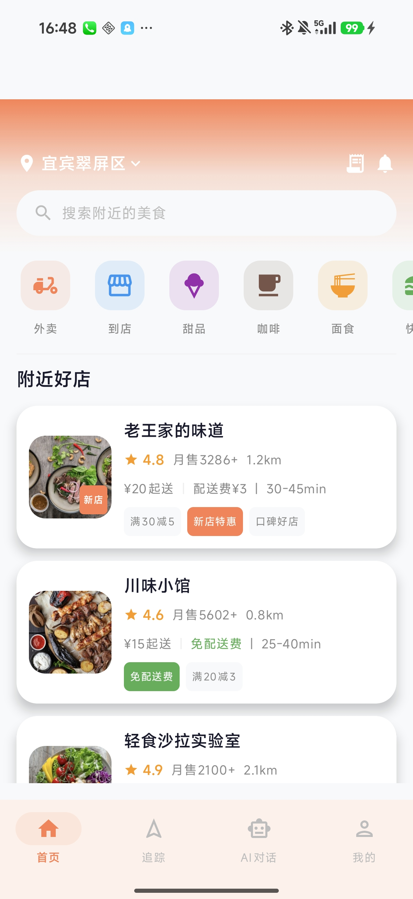
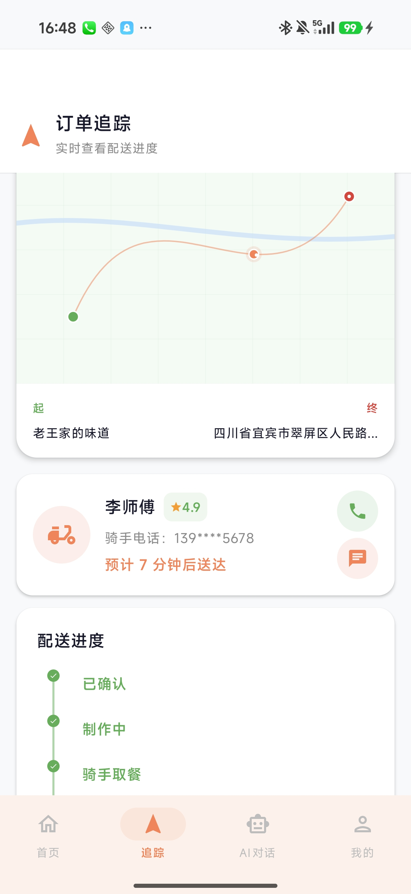
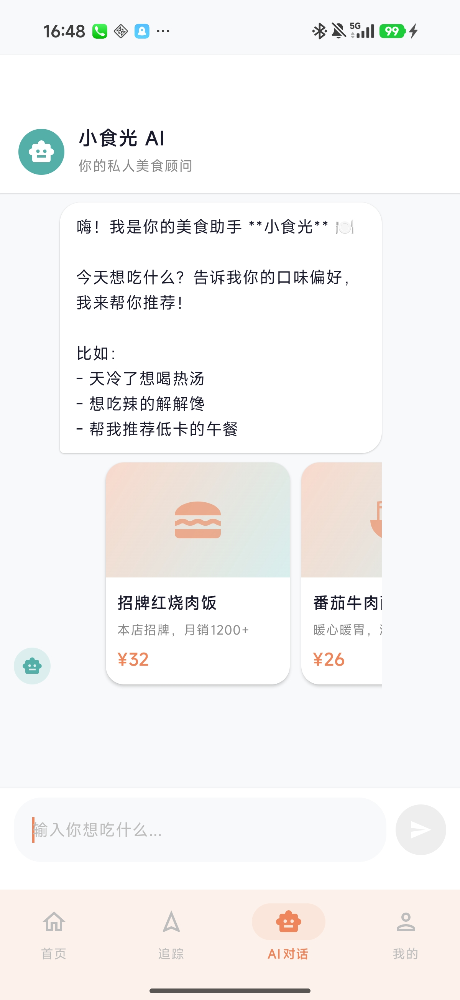
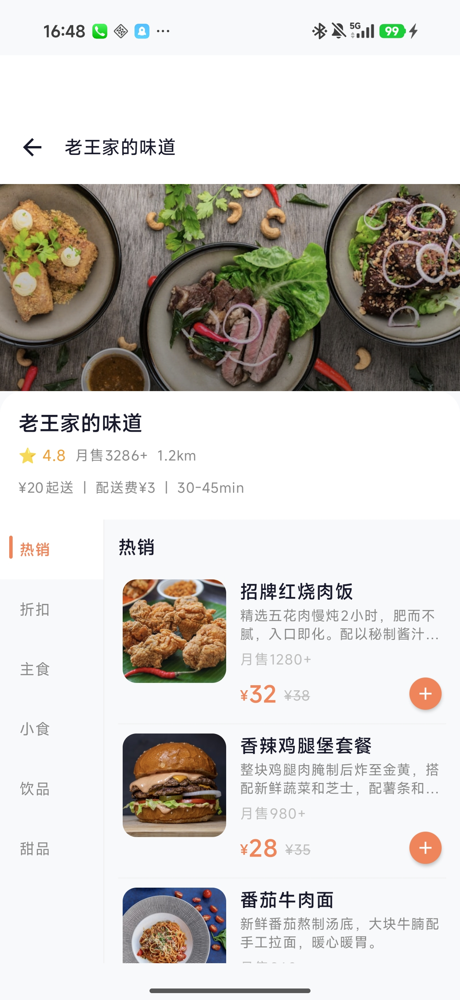

<p align="center">
  
</p>

<h1 align="center">🍽️ BiteLite</h1>
<p align="center"><b>极简 · 现代 · 美味</b></p>
<p align="center">
  
  
  
  
  
  
</p>

---

## ✨ 预览

<p align="center">
  
  
  
  
</p>

## 🏗️ 技术栈

| 类别 | 技术 |
|---|---|
| **语言** | Kotlin |
| **UI** | Jetpack Compose + Material 3 |
| **架构** | MVVM + 单向数据流 (UDF) |
| **导航** | Navigation Compose |
| **依赖注入** | Hilt |
| **异步** | Kotlin Coroutines + Flow |
| **图片** | Coil |
| **AI** | DeepSeek Chat API |
| **网络** | OkHttp |

## 🚀 功能

### 🏠 首页
- 顶部定位 + 搜索栏
- 横向金刚区（外卖/到店/甜品/咖啡等）
- 店铺卡片列表（评分/销量/距离/标签）
- 下拉搜索筛选

### 🏪 店铺详情
- 折叠吸顶头部 + 沉浸式封面
- **左侧分类 + 右侧菜品双联动**
- 底部悬浮购物车条 + 数量步进器
- 购物车 BottomSheet

### 🍜 菜品详情
- 沉浸式大图 + 渐变遮罩
- 规格选择（辣度/甜度/温度）
- 营养成分/过敏原/食材展示
- 加入购物车弹簧动画

### 🛒 结算 & 支付
- 地址编辑弹窗
- 费用明细（配送费/包装费/满减优惠）
- 快捷备注标签
- QR 码支付模拟

### 🗺️ 订单追踪
- **Canvas 手绘风格地图** + 贝塞尔配送路径
- 骑手实时动画 + 脉冲效果
- 配送进度时间线
- 📞 一键添加骑手联系人
- 💬 骑手即时聊天弹窗

### 🤖 AI 美食助手
- **DeepSeek API** 接入
- 根据口味/预算/心情推荐菜品
- 食物推荐卡片（点击直达店铺下单）
- API 不可达自动降级为离线引擎

### 👤 个人中心
- 头像颜色 + 昵称编辑
- 收货地址管理（增删）
- 订单/收藏/优惠券入口

## 📁 项目结构

```
app/src/main/java/com/example/dashdine/
├── di/                    # Hilt 依赖注入
├── data/
│   ├── model/             # 数据实体 (Store/Category/Dish/Order)
│   ├── repository/        # Repository 接口 + Mock 实现
│   ├── mock/              # Mock 数据
│   └── network/           # DeepSeek API 服务
├── navigation/            # 路由 + 导航图 + 底部栏
└── ui/
    ├── theme/             # 主题 (Color/Type/Theme)
    ├── components/        # 通用组件 (SearchBar/StoreCard/DishCard/Stepper)
    ├── home/              # 首页
    ├── store/             # 店铺详情
    ├── dish/              # 菜品详情
    ├── cart/              # 购物车
    ├── checkout/          # 结算 + 支付成功
    ├── payment/           # 支付
    ├── order/             # 订单列表
    ├── tracking/          # 配送追踪
    ├── chat/              # AI 对话
    └── profile/           # 个人中心
```

## 🔧 快速开始

```bash
# 1. 克隆仓库
git clone https://github.com/Zzzzzzy3/zzy_bitelite.git

# 2. 用 Android Studio 打开项目

# 3. 配置 DeepSeek API Key
# 编辑 app/src/main/java/.../data/network/DeepSeekApiService.kt
# 将 YOUR_DEEPSEEK_API_KEY 替换为你的 Key

# 4. 运行
./gradlew assembleDebug
```

## 🎨 设计系统

- **主色调**：珊瑚橘 `#FF7F50` / 薄荷绿 `#20B2AA`
- **背景**：`#F8F9FA`
- **圆角**：卡片 16-24dp
- **风格**：Minimalist & Modern，大面积留白

---

<p align="center">
  Made with ❤️ by BiteLite Team
</p>
